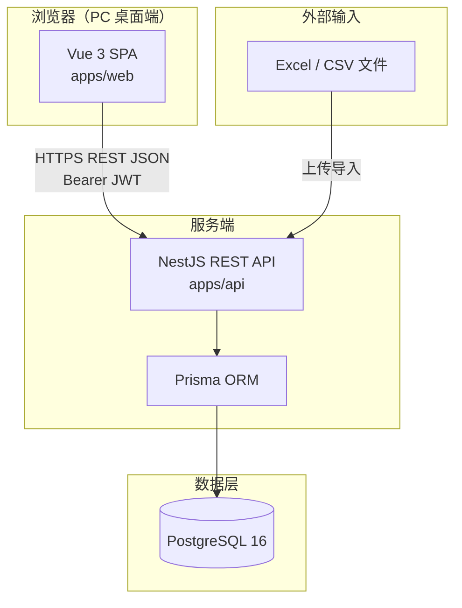
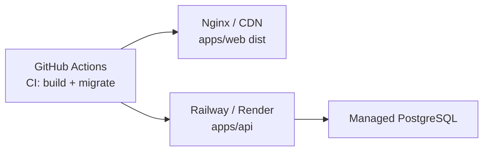
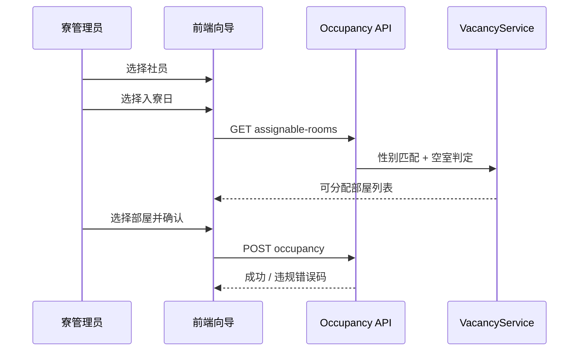

# 寮管理システム — 项目总览（Project Overview）

> **用途**：项目全貌说明、答辩 / PPT 演讲素材、新人 onboarding、对外演示简介  
> **维护要求**：任何功能新增、架构变更、技术栈升级、里程碑完成时，**必须同步更新本文件**（见 `.cursor/rules/project-overview-sync.mdc`）  
> **最后更新**：2026-06-27  
> **文档版本**：1.1.0  
> **实现完成度**：Epic 1–9 业务 ✅；自动化测试 ✅（单元 21 + API 集成 6 + 浏览器 E2E 3）

---

## 一、30 秒电梯演讲（PPT 开场可用）

**寮管理システム**是一套面向公司总务・寮管理担当的 **PC 端 Web 管理系统**，替代约 15 户员工寮原先依赖的 Excel 表格。

系统把 **寮・部屋・入退寮・寮費・空き室・长期利用警告** 集中在一处管理，并在服务端强制 **男女混住禁止、入居期间重叠禁止、性别匹配** 等业务规则。支持 Excel 历史数据一次性导入、操作审计、CSV/印刷导出，为长期利用 3 年警告与値上げ决策提供数据支撑。

**技术路线**：Vue 3 + NestJS + PostgreSQL Monorepo，JWT 认证 + RBAC 权限，Docker 本地/全栈部署，GitHub Actions CI。

---

## 二、项目背景与目标

### 2.1 背景

| 现状痛点 | 系统应对 |
|----------|----------|
| Excel 管理入居者、部屋、寮費，易出错 | 结构化 DB + 表单校验 + 审计日志 |
| 日本社員 / 中国出張社員、男女别寮规则复杂 | 规则内置在 Service 层，API 层拒绝违规 |
| 「初めて寮を使用した入寮日」难以追踪 | 自动设定 + 长期利用 3 年警告列表 |
| 难以审计、难以导出决策数据 | 操作ログ + CSV 导出 + 寮割印刷 |

### 2.2 核心目标（G1–G5）

| 编号 | 目标 | 实现状态 |
|------|------|----------|
| G1 | 寮・部屋・入退寮・寮費・空き室一元管理 | ✅ |
| G2 | 男女混住禁止、入居重叠禁止、性别匹配由系统强制 | ✅ |
| G3 | 基于初回入寮日的长期利用可视（3 年超警告） | ✅ |
| G4 | Excel 初始导入，日常运营脱 Excel | ✅ |
| G5 | 操作ログ、逻辑删除、5 年以上履历保留设计 | ✅ |

### 2.3 MVP 范围 vs 非范围

**In Scope（已实现）**

- 认证与 RBAC（本地账号 + JWT）
- 社員マスタ（日本 / 中国出張区分）
- 寮・部屋マスタ（男性寮 / 女性寮）
- 入退寮履歴 + 业务约束校验
- 初めて寮を使用した入寮日（日本社員）
- 寮費算定与月次记录（面积・日割り）
- 空き室一覧（寮 / 部屋单位、性别过滤）
- Excel 导入（寮・部屋・入居履歴等）
- 操作ログ、备品マスタ、保管场所
- 寮割カレンダー（中心画面）、CSV/印刷导出

**Out of Scope（本期不做）**

| 项目 | 计划 |
|------|------|
| 入居时备品准备 | Phase 2 |
| 退去备品废棄/保管流程 | Phase 2 |
| HR 系统实时同步 | Phase 2 |
| 邮件/Slack 自动通知 | Phase 2 |
| 移动 App | 不需要 |
| 多租户 / 多公司 | 不需要 |

---

## 三、系统架构

### 3.1 逻辑架构



### 3.2 部署架构



### 3.3 请求链路（典型）

```text
views/occupancy/create.vue  submit()
  → api/vacancies.js  getAssignableRooms()
  → VacanciesController.assignableRooms()
  → VacancyService（性别匹配 + 空室判定）
  → Prisma → PostgreSQL
```

---

## 四、技术栈一览

### 4.1 前端（apps/web）

| 类别 | 技术 | 版本 | 用途 |
|------|------|------|------|
| 框架 | Vue 3 | ^3.5 | `<script setup>` 组合式 API |
| 构建 | Vite | ^6.0 | 开发服务器与生产打包 |
| UI | Element Plus | ^2.9 | 表格、表单、对话框、布局 |
| 图标 | @element-plus/icons-vue | ^2.3 | 菜单与按钮图标 |
| 路由 | Vue Router | ^4.5 | SPA 路由 + 全局守卫 |
| 状态 | Pinia | ^2.3 | 用户登录态、侧边栏折叠 |
| HTTP | Axios | ^1.7 | REST 请求、401 刷新重试 |
| 图表 | ECharts | ^5.6 | ダッシュボード（寮別空室・地域別・月次推移） |
| 字体 | Noto Sans JP | — | 全局日文 UI 字体（`theme.css`） |
| 界面语言 | 纯日文 | — | Element Plus `locale: ja`；用户可见文案均为日文 |

### 4.2 后端（apps/api）

| 类别 | 技术 | 版本 | 用途 |
|------|------|------|------|
| 运行时 | Node.js | ≥20 | 服务端 JavaScript 运行时 |
| 框架 | NestJS | ^10.4 | 模块化 REST API |
| ORM | Prisma | ^6.1 | 类型安全 DB 访问与迁移 |
| 数据库 | PostgreSQL | 16 | 业务数据持久化 |
| 认证 | JWT + bcrypt | — | Access + Refresh Token |
| 校验 | class-validator | ^0.15 | DTO 入参校验 |
| Excel | xlsx | ^0.18 | 导入解析 |
| 精度 | decimal.js | ^10.6 | 寮費金额计算 |

### 4.3 工程与运维

| 类别 | 技术 | 用途 |
|------|------|------|
| Monorepo | pnpm workspace | `apps/web` + `apps/api` 并行开发 |
| 容器 | Docker Compose | 本地 PostgreSQL + Adminer + 全栈演示 |
| CI | GitHub Actions | API/Web build + Prisma migrate |
| 反向代理 | Nginx（生产建议） | 静态托管前端 dist |
| AI 辅助 | Cursor + Agentic SDLC | 文档驱动全栈生成与迭代 |

### 4.4 API 约定

| 项 | 规范 |
|----|------|
| Base URL | `/api/v1` |
| 认证 | `Authorization: Bearer <access_token>` |
| 响应 | `{ code: 0, message, data }` |
| 分页 | `?page=1&pageSize=20` → `{ items, total, page, pageSize }` |
| 日期 | `YYYY-MM-DD`（Asia/Tokyo） |
| 删除 | 逻辑删除 `deleted_at` |
| 并发 | 乐观锁 `version`（社員/寮/部屋/料率/入退寮） |

### 4.5 UI 设计（2026-06 改版）

| 项 | 规范 |
|----|------|
| 布局 | ダークサイドバー（`#0f172a`）+ ライトコンテンツ（インディゴ/シアンアクセント） |
| 字体 | Noto Sans JP |
| 语言 | **纯日文**：菜单、表单、按钮、空状态、Toast 均为日文（ＣＳＶ出力等） |
| 仪表盘 | 「寮運営コックピット」— KPI 4 枚 + ECharts（寮別空室・地域別・月次推移）+ 操作ログ |
| Element Plus | `locale: ja`；主题色 `--el-color-primary: #0891b2` |

---

## 五、项目目录结构

```text
ProjectWyp/                          # Monorepo 根目录
├── apps/
│   ├── web/                         # ★ 正式前端（Vue 3 + Vite）
│   │   ├── index.html
│   │   ├── vite.config.js
│   │   └── src/
│   │       ├── api/                 # 按业务域扁平接口文件（15 个）
│   │       ├── assets/              # theme.css（ダークサイドバー + ライトグラデーション）
│   │       ├── components/          # PageHeader, charts/{DashboardStatCard,BaseChart}, PaginationBar
│   │       ├── constants/enums.js   # 枚举与**日文**标签（纯日文 UI）
│   │       ├── directives/          # v-permission 权限指令
│   │       ├── layout/              # 认证后外壳 Sidebar + Header
│   │       ├── router/              # 路由定义 + menus.js 侧边栏
│   │       ├── store/               # Pinia: user.js, app.js
│   │       ├── utils/               # request.js, date.js, permission.js
│   │       └── views/               # 业务页面（见 §7.2）
│   └── api/                         # ★ 正式后端（NestJS + Prisma）
│       ├── prisma/
│       │   ├── schema.prisma        # 数据模型定义
│       │   ├── migrations/          # DB 迁移历史
│       │   └── seed.ts              # 种子数据（含默认管理员）
│       └── src/
│           ├── main.ts              # 启动入口
│           ├── app.module.ts        # 根模块
│           ├── common/              # 拦截器、守卫、DTO 基类
│           ├── prisma/              # PrismaModule
│           └── modules/             # 业务模块（见 §7.1）
├── docs/                            # SDLC 工程文档
│   ├── PROJECT-OVERVIEW.md          # ★ 本文件（项目总览 / PPT 素材）
│   ├── 00-project-status.md         # 当前状态与未确认项
│   ├── stage-0 ~ stage-9            # 分阶段设计文档
│   ├── stage-x-task-breakdown.md    # 任务拆解与完成状态
│   └── apidoc/                      # 接口速查（对齐前端 api/*.js）
├── dom-dev/doc/                     # 详细设计参考（日文要件）
├── func_front.md                    # 前端功能索引（开发前必读）
├── .cursor/
│   ├── rules/                       # AI 持久化规则（含文档同步）
│   └── agents/                      # 前端开发工程师等智能体定义
├── .github/workflows/ci.yml         # CI 流水线
├── docker-compose.yml               # Postgres + Adminer + 全栈 profile
├── package.json                     # pnpm workspace 根脚本
├── README.md                        # 快速启动
└── .env.example                     # 环境变量模板
```

---

## 六、数据模型（PostgreSQL）

### 6.1 核心实体

| 模型 | 表名 | 说明 |
|------|------|------|
| User | users | 应用登录账号（非入居社員） |
| Department | departments | 所属マスタ |
| Employee | employees | 社員マスタ（含 first_dorm_use_date） |
| Dorm | dorms | 寮マスタ（性别种别、地区、责任者★） |
| Room | rooms | 部屋マスタ（面积、种别、容量） |
| OccupancyHistory | occupancy_histories | 入退寮履歴 |
| FeeRate | fee_rates | 费率主数据（按 room_type + 生效期） |
| DormFee | dorm_fees | 月次寮費（含 calculation_basis JSON） |
| EquipmentItem | equipment_items | 备品マスタ |
| StorageLocation | storage_locations | 保管场所 |
| AuditLog | audit_logs | 操作审计（before/after JSON） |
| ImportJob | import_jobs | Excel 导入任务状态 |
| SystemSetting | system_settings | 系统配置（如退寮预警天数） |

### 6.2 关键枚举

| 枚举 | 值 | 业务含义 |
|------|-----|----------|
| UserRole | SYSTEM_ADMIN / DORM_MANAGER / VIEWER | 应用角色 |
| EmployeeType | JAPAN / CHINA_ASSIGNMENT | 日本社員 / 中国出張 |
| DormGenderType | MALE_DORM / FEMALE_DORM | 男性寮 / 女性寮 |
| Location | TOKYO / OSAKA / NAGOYA / OTHER | 寮所在地 |
| RoomType | WESTERN / JAPANESE_* / STORAGE_ROOM / OTHER | 部屋种别（影响费率） |
| FeeStatus | DRAFT / CONFIRMED | 寮費草稿 / 已确定 |

### 6.3 核心业务规则（服务端强制）

| 规则 | 实现位置 |
|------|----------|
| 同室日粒度禁止多人、期间重叠禁止 | `OccupancyService.validateNoOverlap()` |
| 性别与寮种别必须一致 | `OccupancyService.validateGenderMatch()` |
| 初回入寮日自动设定（日本社員） | `OccupancyService` + `employees.first_dorm_use_date` |
| 长期利用 3 年警告 | `getLongTermWarnings` API |
| 寮費日割り算定 | `FeeCalculationService` + `calculation_basis` 留存 |
| 空き室判定 | `VacancyService` |
| 在室口径 | **闭区间**：退寮日当天算在室；NULL 退寮 = 无期限 |

---

## 七、功能模块详解

### 7.1 后端 API 模块（apps/api/src/modules）

| 模块 | Controller | 主要能力 | 状态 |
|------|------------|----------|------|
| auth | AuthController | 登录 / 刷新 / 当前用户 | ✅ |
| users | UsersController | 应用账号 CRUD | ✅ |
| departments | DepartmentsController | 所属マスタ CRUD | ✅ |
| employees | EmployeesController | 社員 CRUD + 初回日修正 | ✅ |
| dorms | DormsController | 寮 CRUD + 部屋子资源 | ✅ |
| occupancy | OccupancyController | 入退寮 + 长期利用警告 | ✅ |
| fees | FeesController | 寮費算定/确认 + 费率主数据 | ✅ |
| vacancies | VacanciesController | 空室一覧 + 可分配部屋 | ✅ |
| calendar | CalendarController | 寮割カレンダー数据 | ✅ |
| export | ExportController | CSV 导出（入退寮/寮費/月历） | ✅ |
| import | ImportController | Excel 上传→映射→预览→执行 | ✅ |
| audit | AuditController | 操作ログ查询 | ✅ |
| equipment | EquipmentController | 备品 + 保管场所 CRUD | ✅ |
| system-settings | SystemSettingsController | 退寮预警天数等 | ✅ |

### 7.2 前端页面（apps/web/src/views）

| 路由 | 页面 | 功能摘要 | 权限 |
|------|------|----------|------|
| `/login` | ログイン | メール/パスワード + JWT | 公開 |
| `/` | ホーム | 精简首页：在室/空室 KPI + ToDo + 快捷操作 | 全ロール |
| `/allocation-calendar` | 寮割カレンダー | **中心画面**：月历网格、冲突提示、印刷/ＣＳＶ | 読取 |
| `/employees` | 社員管理 | CRUD + 所属 + 初回日修正 + 乐观锁 | 读/写 |
| `/employees/:id` | 社員詳細 | 360° ビュー（在室・履歴・寮費） | 读 |
| `/dorms` | 寮一覧 | 寮 CRUD + 乐观锁 | 读/写 |
| `/dorms/:id` | 寮详情 | 信息 + 部屋 CRUD + 履历 | 读/写 |
| `/occupancy` | 入退寮 hub | 入寮/退寮/履歴 三选一操作入口 | 读 |
| `/occupancy/history` | 入退寮履歴 | 列表 + 筛选 + CSV 导出 | 读 |
| `/occupancy/create` | 入寮向导 | 社員から／寮から 双路径 | 写 |
| `/occupancy/move-out` | 退寮向导 | 社員から／寮から 双路径 | 写 |
| `/occupancy/:id/move-out` | 退寮（行内） | 退寮日/理由 + 乐观锁 | 写 |
| `/occupancy/long-term` | 长期利用警告 | 3 年超列表 | 读 |
| `/fees` | 寮費一覧 | 列表、导出、算定根拠、确认草稿 | 读/写 |
| `/fees/calculate` | 批量算定 | 指定年月批量计算 | 写 |
| `/fees/rates` | 料率マスタ | CRUD + 乐观锁 | 仅 ADMIN |
| `/vacancies` | 空き室 | 指定日期空室状况 | 读 |
| `/import` | Excel 导入 | 4 步向导 | 写 |
| `/equipment` | 备品管理 | 备品 + 保管场所双 Tab | 读/写 |
| `/audit` | 操作ログ | 只读 + 前后值抽屉 | ADMIN/MANAGER |
| `/settings/departments` | 所属設定 | 所属マスタ CRUD | 仅 ADMIN |
| `/settings/users` | 用户管理 | 应用账号 CRUD | 仅 ADMIN |
| `/403` | 无权限 | 权限不足提示 | 公开 |

### 7.3 角色与权限（RBAC）

| 角色 | 定位 | 典型权限 |
|------|------|----------|
| SYSTEM_ADMIN | 系统管理员 | 全部模块 + 用户/费率/所属/审计 |
| DORM_MANAGER | 寮管理员 | 日常入退寮、寮費、空室、导入、备品 |
| VIEWER | 只读用户 | 查询与导出，不可变更业务数据 |

详细矩阵见 `docs/stage-2-users-rbac.md`。

---

## 八、典型业务流程（PPT 演示脚本参考）

### 8.1 入寮登记（核心演示流）



**演示要点**：故意选择性别不匹配的寮 → 系统拒绝；选择已有入居者的部屋与重叠日期 → 系统拒绝。

### 8.2 Excel 迁移（脱 Excel 叙事）

1. 上传现有 `.xlsx`
2. 列映射 UI 对齐现物 Excel 列名
3. 预览校验（错误行高亮）
4. 事务导入 → 结果报表
5. 导入后继续日常 Web 录入

### 8.3 寮費月次算定

1. 维护费率主数据（按 room_type + 生效期）
2. 指定年月批量算定 → 生成 DRAFT 记录
3. 查看 `calculation_basis`（日割り根拠）
4. 确认 → CONFIRMED + 审计日志

### 8.4 长期利用管理

- 日本社員首次入寮日自动记录
- 仪表盘 + `/occupancy/long-term` 列表展示 3 年超警告
- 支持 CSV 导出供値上げ讨论

---

## 九、开发与运行

### 9.1 快速启动

```bash
pnpm install
npm run db:setup    # 首次：Docker PG + migrate + seed
pnpm dev            # 同时启动 web + api
```

| 服务 | 地址 |
|------|------|
| Web | http://localhost:3000 |
| API | http://localhost:3001/api/v1 |
| Health | http://localhost:3001/api/v1/health |
| Adminer | http://localhost:8080 |

**默认管理员**（seed）：`admin@example.com` / `Admin123!!`

### 9.2 常用命令

| 命令 | 说明 |
|------|------|
| `pnpm dev:web` | 仅前端 |
| `pnpm dev:api` | 仅后端 |
| `pnpm build` | 全栈构建 |
| `npm run db:up` | 启动 Postgres + Adminer |
| `npm run docker:full` | 全栈容器演示 |
| `pnpm test` | 后端单元 + API 集成测试（需 DB 已 migrate + seed） |
| `pnpm test:unit` | 仅单元测试（不需数据库） |
| `pnpm test:web` | 浏览器 E2E（需 DB + 会自动起 web/api） |

### 9.3 环境变量

见 `.env.example`：`DATABASE_URL`、`JWT_*`（API）、`VITE_API_BASE_URL`（Web）。

---

## 十、项目进度与质量

### 10.1 Epic 完成状态

| Epic | 范围 | 状态 |
|------|------|------|
| 1 | Monorepo + 骨架 | ✅ |
| 2 | 认证与权限 | ✅ |
| 3 | 主数据（社員・寮・部屋） | ✅ |
| 4 | 入退寮与约束 | ✅ |
| 5 | 寮費 | ✅ |
| 6 | 空き室 | ✅ |
| 7 | Excel 导入 + CSV 导出 | ✅ |
| 8 | 审计与备品 | ✅ |
| 9 | 测试与部署 | ✅ CI + Docker + Jest + Playwright |

### 10.2 自动化测试（已实现）

| 类型 | 位置 | 数量 | 覆盖要点 |
|------|------|------|----------|
| 单元测试 | `apps/api/src/**/*.spec.ts` | 21 | 日期闭区间、入居重叠/性别、寮費日割り |
| API 集成 | `apps/api/test/app.e2e-spec.ts` | 6 | 登录、入居拒绝、寮費算定、健康检查 |
| 浏览器 E2E | `apps/web/e2e/*.spec.js` | 3 | 登录成功/失败、入居向导页 |

**运行方式**（需 PostgreSQL：`npm run db:setup` 首次初始化）：

```bash
pnpm test              # 单元 + API 集成
pnpm test:unit         # 仅单元（最快，不需 DB）
pnpm test:web          # 浏览器 E2E
```

CI（`.github/workflows/ci.yml`）在每次 push 时自动跑单元 + API 集成测试。

### 10.3 可选后续增强

| 项 | 说明 |
|----|------|
| 浏览器 E2E 接入 CI | 当前 CI 仅跑后端测试；Web E2E 本地 `pnpm test:web` |
| 覆盖率报告 | `npm run test:cov --prefix apps/api` |

### 10.4 KPI 验收目标（MVP 后 3 个月）

| KPI | 目标 |
|-----|------|
| Excel 依赖度 | 日常业务 0 Excel |
| 入居冲突 | 0 件重叠/性别违规 |
| 数据迁移 | ≥95% 历史行成功导入 |
| 主要流程 | ≤5 次点击完成入居登记 |
| 可用性 | 工作时间 ≥99%（单实例 MVP） |

---

## 十一、PPT 演讲大纲建议（可直接拆页）

| 页序 | 标题 | 内容要点 |
|------|------|----------|
| 1 | 封面 | 寮管理システム、汇报人、日期 |
| 2 | 背景与痛点 | Excel 管理 15 户寮的困境（§2.1） |
| 3 | 项目目标 | G1–G5 五张卡片 |
| 4 | 用户与价值 | 総務担当 / 管理层 / IT 三方价值 |
| 5 | 系统架构 | §3.1 Mermaid 图 |
| 6 | 技术选型 | §4 表格（Vue + NestJS + PG） |
| 7 | 功能全景 | §7.2 页面矩阵截图拼贴 |
| 8 | 核心业务规则 | 性别/重叠/初回日/长期利用 |
| 9 | **中心画面演示** | 寮割カレンダー live demo |
| 10 | 入寮向导演示 | 4 步流程 + 违规拦截 |
| 11 | Excel 导入 | 脱 Excel 迁移故事 |
| 12 | 寮費算定 | 日割り + 根拠 JSON |
| 13 | 权限与安全 | RBAC 三角角色 + 审计 |
| 14 | 工程化交付 | Monorepo + Docker + CI + AI SDLC |
| 15 | 进度与展望 | Epic 状态 + Phase 2 路线图 |
| 16 | Q&A | — |

**演讲技巧**：第 9–11 页做 live demo；第 14 页强调「AI 辅助全栈 SDLC 可交付性评估」若面向技术评委。

---

## 十二、相关文档索引

| 用途 | 文件 |
|------|------|
| **本总览（PPT 素材）** | `docs/PROJECT-OVERVIEW.md` |
| 快速启动 | `README.md` |
| 前端功能清单 | `func_front.md` |
| 项目当前状态 | `docs/00-project-status.md` |
| 任务完成度 | `docs/stage-x-task-breakdown.md` |
| 技术架构 | `docs/stage-0-architecture.md` |
| 立项说明书 | `docs/stage-1-project-charter.md` |
| RBAC | `docs/stage-2-users-rbac.md` |
| PRD | `docs/stage-3-prd.md` |
| 数据库 ER | `docs/stage-4-database.md` |
| API 规格 | `docs/stage-5-api-spec.md` |
| API 速查 | `docs/apidoc/README.md` |
| 部署 | `docs/stage-9-deployment.md` |
| 详细设计（日文） | `dom-dev/doc/详细设计/` |

---

## 十三、文档维护 changelog

| 版本 | 日期 | 变更摘要 |
|------|------|----------|
| 1.0.0 | 2026-06-06 | 初版：汇总项目结构、功能、技术栈、PPT 大纲 |
| 1.1.0 | 2026-06-06 | 新增自动化测试：Jest 单元/API 集成 + Playwright E2E |
| 1.2.0 | 2026-06-06 | UI 全面改版：ダークサイドバー + ライトコンテンツ、寮運営コックピット（ECharts）、纯日文界面 |
| 1.4.1 | 2026-06-20 | 导航/UI：首页显示名「ダッシュボード」→「ホーム」 |
| 1.5.0 | 2026-06-20 | 安全/UX 全面加固：后端 RBAC、404 页、移动端侧边栏、ListLoadAlert/DetailNotFound 全列表与详情页、审计可读 diff 等 |
| 1.4.0 | 2026-06-20 | UX 改造恢复：ActionHubCard/StatusBadge/面包屑、入退寮 hub、双路径向导、社員 360°、履歴筛选、浅色分组侧边栏 |
| 1.6.0 | 2026-06-27 | 部署：Cloudflare Pages 构建仅 web；Deploy command 须留空（勿用 wrangler deploy） |

---

> **给 AI / 开发者**：修改代码或文档后，请对照 `.cursor/rules/project-overview-sync.mdc` 检查本文件是否需要同步更新。
