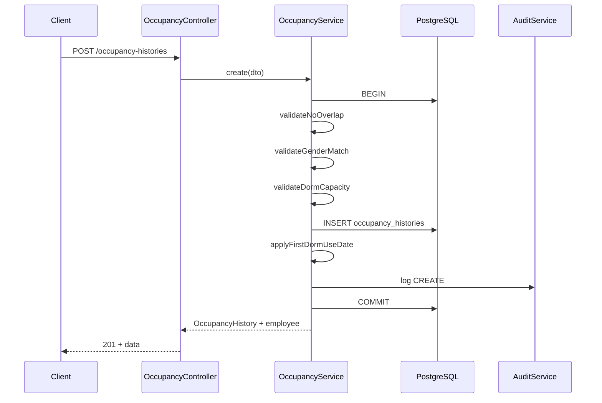

# 寮管理システム — 详细设计书

| 项目 | 内容 |
|------|------|
| 文档编号 | DD-DORM-001 |
| 版本 | 1.2.1 |
| 状态 | 对齐最新要件定義書（詳細版）A（2026/5/20）；可进入 Stage 7 编码 |
| 关联文档 | `docs/stage-0` ~ `stage-9`、`寮管理システム 要件定義書（詳細版)A.docx` |

---

## 0. 口径权威索引（SSOT）

实现与测试**必须**以下章节为准；其它文档/模块说明**只引用、不重复定义**业务公式。

| # | 主题 | 权威出处 |
|---|------|----------|
| 1 | 在室判定、期间重叠、NULL 退寮 | `docs/stage-5-api-spec.md` **§5.2.1**；本文 **§5.1、§5.2.2** |
| 2 | 空室判定 | 本文 **§5.4.1**（引用 §5.1） |
| 3 | 寮割カレンダー | `docs/stage-5-api-spec.md` **§5.6.1**；`docs/stage-6-page-design.md` **`/allocation-calendar`** |
| 4 | 地域 `location` | `docs/stage-4-database.md` **Location 枚举** |
| 5 | 乐观锁 `version` | `docs/stage-4-database.md`；冲突 **40910** |
| 6 | 責任者 ★ | `dorms.responsible_employee_id`；本文 **§5.9** |
| 7 | 所属マスタ | `departments` + `employees.department_id`；本文 **§5.10** |
| 8 | 入退寮変更履历 | `audit_logs` 强制写入点；本文 **§5.8** |
| 9 | CSV 导出 / 印刷 | `docs/stage-5-api-spec.md` **§5.13~5.14** |
| 10 | 文档 vs 代码差距 | `docs/doc-vs-code-gap.md` |

要件定义书（最新版）路径：`寮管理システム 要件定義書（詳細版)A.docx`（2026/5/20）。

---

## 1. 文档目的与读者

### 1.1 目的

本文档在 PRD（Stage 3）、数据库（Stage 4）、API（Stage 5）、页面（Stage 6）之上，给出**可直接编码**的模块划分、类职责、核心算法、事务边界、时序与状态机，供 Backend / Frontend / QA 在同一语义下实现与测试。

### 1.2 读者

| 角色 | 使用方式 |
|------|----------|
| Backend | 按 §4 模块与 §5 算法实现 NestJS Service / Controller |
| Frontend | 按 §6 页面-API 绑定与 §7 前端结构实现；**分模块编码**见 `前端模块/README.md`（v2.0，Vue3 + Element Plus） |
| QA | 按 §8 与 `docs/stage-8-test-design.md` 编写用例 |
| PM | 追溯 §9 需求矩阵 |

### 1.3 设计原则

1. **业务规则仅在服务端强制执行**（前端校验为辅助）
2. **MVP 单体 Monorepo**，不拆微服务
3. **写操作必记 audit_logs**（确定、导入、入退寮）
4. **日期业务一律 `YYYY-MM-DD`（Asia/Tokyo）**，DB 存 `@db.Date`

---

## 2. 系统上下文

### 2.1 上下文图

```text
┌─────────────┐     HTTPS/JWT      ┌──────────────────────────────┐
│ 総務・寮管理 │ ────────────────► │ 社員寮管理システム (本系统)    │
│ 担当者       │ ◄──────────────── │ apps/web + apps/api          │
└─────────────┘                    └───────────┬──────────────────┘
                                               │ Prisma
                                               ▼
                                    ┌──────────────────┐
                                    │ PostgreSQL 16    │
                                    └──────────────────┘
        ┌─────────────┐
        │ Excel .xlsx │ ──一次性/定期──► Import 模块
        └─────────────┘
```

### 2.2 部署与运行时（摘要）

| 组件 | 路径 | 端口（本地） |
|------|------|--------------|
| Web | `apps/web` | 3000 |
| API | `apps/api` | 3001 |
| DB | Docker PostgreSQL | 5432 |

环境变量见仓库根 `.env.example`；`LONG_TERM_DORM_YEARS=3` 控制长期利用阈值。

### 2.3 技术栈（锁定）

与 `docs/stage-0-architecture.md` 一致：**Vue3 + Vite + Element Plus + Axios + Echarts**（`apps/web`）、NestJS、Prisma、PostgreSQL、JWT Access/Refresh。

---

## 3. 逻辑架构与模块依赖

### 3.1 后端模块图

```text
                    ┌─────────┐
                    │  Auth   │
                    └────┬────┘
                         │ JWT / Guards
     ┌───────────────────┼───────────────────┐
     ▼                   ▼                   ▼
┌──────────┐      ┌─────────────┐      ┌───────────┐
│ Employees│      │ Dorms/Rooms │      │ FeeRates  │
└────┬─────┘      └──────┬──────┘      └─────┬─────┘
     │                   │                     │
     └─────────┬─────────┴──────────┬──────────┘
               ▼                    ▼
        ┌──────────────┐    ┌─────────────┐
        │  Occupancy   │───►│  DormFees   │
        └──────┬───────┘    └─────────────┘
               │
               ▼
        ┌──────────────┐    ┌─────────────┐
        │  Vacancies   │    │   Import    │
        └──────────────┘    └─────────────┘
               │
               ▼
        ┌──────────────┐    ┌─────────────┐
        │   Audit      │◄───│ Equipment   │
        └──────────────┘    └─────────────┘
```

### 3.2 模块清单

| 模块 | NestJS 路径 | 职责 |
|------|-------------|------|
| AuthModule | `modules/auth` | 登录、刷新、当前用户、密码策略 |
| UsersModule | `modules/users` | 应用账号 CRUD（Admin） |
| EmployeesModule | `modules/employees` | 社員マスタ、初回入寮日修正 |
| DormsModule | `modules/dorms` | 寮マスタ |
| RoomsModule | `modules/rooms` | 部屋マスタ（挂 dorm） |
| OccupancyModule | `modules/occupancy` | 入退寮履歴、约束、长期利用 |
| CalendarModule | `modules/calendar` | 寮割カレンダー集计、冲突检测、退寮警告 |
| ExportModule | `modules/export` | CSV 导出（履歴・寮費・寮割） |
| FeesModule | `modules/fees` | 费率、月次算定、确定 |
| VacanciesModule | `modules/vacancies` | 空室・可入居部屋 |
| EquipmentModule | `modules/equipment` | 备品・保管场所 |
| ImportModule | `modules/import` | Excel 上传/映射/执行 |
| AuditModule | `modules/audit` | 操作ログ查询 |
| PrismaModule | `prisma` | 单例 PrismaClient |

### 3.3 共享基础设施

| 组件 | 路径 | 说明 |
|------|------|------|
| `ApiResponseInterceptor` | `common/interceptors` | 包装 `{ code, message, data }` |
| `HttpExceptionFilter` | `common/filters` | 映射业务异常 → HTTP + code |
| `PermissionsGuard` | `common/guards` | 校验 JWT + permission 点 |
| `AuditService` | `common/services/audit.service.ts` | 统一写 audit_logs |
| `DateUtil` | `packages/shared` | 东京时区日期解析、月天数 |

---

## 4. 领域模型与枚举（实现级）

### 4.1 核心实体关系

与 `docs/stage-4-database.md` Prisma Schema 一致，实施时**原样复制**到 `apps/api/prisma/schema.prisma`。

关键关系：

- `Dorm` 1:N `Room`
- `Employee` 1:N `OccupancyHistory` N:1 `Room`
- `Employee.first_dorm_use_date`：独立于履歴，仅日本社員首次入居写入
- `DormFee`：`(employee_id, year_month)` 唯一

### 4.2 枚举与前端共享

枚举：前端 `apps/web/src/constants/enums.js`；后端 Prisma `@prisma/client` 枚举；表单校验使用 Element Plus Form Rules。

```typescript
export enum UserRole {
  SYSTEM_ADMIN = 'SYSTEM_ADMIN',
  DORM_MANAGER = 'DORM_MANAGER',
  VIEWER = 'VIEWER',
}

export enum EmployeeType {
  JAPAN = 'JAPAN',
  CHINA_ASSIGNMENT = 'CHINA_ASSIGNMENT',
}

export enum DormGenderType {
  MALE_DORM = 'MALE_DORM',
  FEMALE_DORM = 'FEMALE_DORM',
}

export enum FeeStatus {
  DRAFT = 'DRAFT',
  CONFIRMED = 'CONFIRMED',
}
```

### 4.3 软删除策略

| 操作 | 行为 |
|------|------|
| 默认查询 | `where: { deleted_at: null }` |
| DELETE API | `update deleted_at = now()` |
| 关联校验 | 有有效入居履歴的部屋不可软删；有 DRAFT/CONFIRMED 寮費的社員删除需业务确认（MVP：禁止删除有履歴社員） |

---

## 5. 核心业务设计

### 5.1 在室判定（全局约定）

查询基准日 `D`（`asOfDate`，默认今日东京）：

**社員在某部屋在室** 当且仅当存在履歴 `h` 满足：

```text
h.move_in_date <= D
AND (h.move_out_date IS NULL OR h.move_out_date >= D)
AND h.deleted_at IS NULL
```

**重要（与最新要件定義書一致）**：退寮日 `move_out_date` 当天**算在室**（闭区间结束）。  
`move_out_date IS NULL` 视为无期限入居（等价 `9999-12-31`）。

### 5.2 OccupancyService

**文件**：`apps/api/src/modules/occupancy/occupancy.service.ts`

#### 5.2.1 类职责

| 方法 | 说明 |
|------|------|
| `create(dto, userId)` | 入居登记（事务） |
| `update(id, dto, userId)` | 未退寮前修改 |
| `moveOut(id, dto, userId)` | 退寮 |
| `validateNoOverlap(roomId, start, end, excludeId?)` | 期间重叠 |
| `validateGenderMatch(employeeId, roomId)` | 性别与寮种别 |
| `validateDormCapacity(dormId, asOfDate)` | 户内 ≤3 人 |
| `applyFirstDormUseDate(employeeId, moveInDate, tx)` | 初回日写入 |

#### 5.2.2 期间重叠算法

输入：`roomId`, `start`（入寮日）, `end`（退寮日或 `null` 表无限）, 可选 `excludeHistoryId`。

```typescript
function intervalsOverlap(
  aStart: Date,
  aEnd: Date | null,
  bStart: Date,
  bEnd: Date | null,
): boolean {
  const aEndEff = aEnd ?? new Date('9999-12-31');
  const bEndEff = bEnd ?? new Date('9999-12-31');
  // 闭区间：结束日当天算在室 → 相邻同日视为重叠（aEnd === bStart 视为重叠）
  return aStart <= bEndEff && bStart <= aEndEff;
}
```

查询同室所有未删除履歴，逐条比较；任一条重叠则抛 `OccupancyOverlapException`（HTTP 409, code 40901）。

#### 5.2.3 性别匹配

```typescript
const employee = await tx.employee.findUniqueOrThrow({ where: { id: employeeId } });
const room = await tx.room.findUniqueOrThrow({
  where: { id: roomId },
  include: { dorm: true },
});
const expected =
  employee.gender === 'MALE' ? 'MALE_DORM' : 'FEMALE_DORM';
if (room.dorm.gender_type !== expected) {
  throw new GenderMismatchException();
}
```

#### 5.2.4 户内容量（3DK 最多 3 人）

在 `move_in_date` 至 `move_out_date`（或 ∞）覆盖的**每一个日历日**上，统计该 `dorm_id` 下在室人数；若任一日 > 3 则拒绝。

MVP 实现：仅在校验**新入居区间**与现有履歴合并后的**峰值人数**（对 15 户规模足够；全日期扫描可作为优化项）。

简化峰值算法：

1. 取该寮在 `[start, end]` 内所有履歴（含新入居）
2. 收集所有 `move_in_date` 与 `move_out_date`（非空）作为事件点
3. 按日扫描事件点，计数在室人数，取 max
4. 若 `max > 3` → `DormCapacityExceededException`（40903）

#### 5.2.5 初回入寮日

```typescript
async applyFirstDormUseDate(
  employeeId: string,
  moveInDate: Date,
  tx: Prisma.TransactionClient,
): Promise<void> {
  const emp = await tx.employee.findUniqueOrThrow({ where: { id: employeeId } });
  if (emp.employee_type !== 'JAPAN') return;
  if (emp.first_dorm_use_date != null) return;
  await tx.employee.update({
    where: { id: employeeId },
    data: { first_dorm_use_date: moveInDate },
  });
}
```

Admin 手工修正：`PATCH /employees/:id/first-dorm-use-date`，仅 `SYSTEM_ADMIN`，写 audit。

#### 5.2.6 create 事务流程



**前置校验（DTO）**：

- `moveInDate` 必填
- 若 `moveOutDate` 有值：`moveInDate <= moveOutDate`
- `employeeId`, `roomId` UUID 存在且未软删

### 5.3 moveOut 设计

| 字段 | 规则 |
|------|------|
| `moveOutDate` | ≥ `move_in_date`；≤ 今日（可配置是否允许未来退寮，MVP 允许未来予定退寮） |
| `moveOutReason` | 可选，最大 500 字 |

更新 `move_out_date`, `move_out_reason`；**不修改** `first_dorm_use_date`。

### 5.4 VacancyService

**文件**：`apps/api/src/modules/vacancies/vacancy.service.ts`

#### 5.4.1 部屋空室判定（基准日 D）

部屋 `R` 为空 ⟺ 同时满足：

1. 不存在在室履歴（**按 §5.1 闭区间**：`move_in <= D` 且 `move_out IS NULL OR move_out >= D`）
2. 不存在 `move_in_date > D` 的将来入居予定

> 边界：`move_out_date = D` 当天**仍在室**，故**不是**空室。

#### 5.4.2 GET /vacancies

1. 查询 `dorms`（filter: `location`, `genderType`，`deleted_at null`）
2. 对每个 dorm 加载 rooms
3. 对每个 room 调用 `getRoomStatus(roomId, D)` → `VACANT` | `OCCUPIED` | `RESERVED`（将来予定）
4. 聚合 `vacantRooms` 列表

#### 5.4.3 GET /vacancies/assignable-rooms

输入：`employeeId` 或 `gender` + `asOfDate`

1. 解析性别
2. 筛选 `dorm.gender_type` 匹配
3. 仅返回 `VACANT` 部屋
4. 排序：同 `location` 优先 → 寮名

### 5.5 FeeCalculationService

**文件**：`apps/api/src/modules/fees/fee-calculation.service.ts`

#### 5.5.1 月次算定公式

对 `employee_id` + `year_month`（如 `2026-04`）：

```text
occupied_days = 该月在室日历日数（按 §5.1，逐日判断）
days_in_month   = 该月天数
daily_rate      = fee_rates 中 room_type 在当月有效的单价
amount_yen      = round(area_sqm * daily_rate * occupied_days / days_in_month, 0)
```

`calculation_basis` JSON：

```json
{
  "areaSqm": 8.5,
  "roomType": "WESTERN",
  "dailyRateYen": 500,
  "occupiedDays": 15,
  "daysInMonth": 30,
  "roomId": "uuid",
  "occupancyHistoryIds": ["uuid"]
}
```

#### 5.5.2 费率选取

```sql
-- 逻辑等价
SELECT * FROM fee_rates
WHERE room_type = :roomType
  AND effective_from <= :monthEnd
  AND (effective_to IS NULL OR effective_to >= :monthStart)
ORDER BY effective_from DESC
LIMIT 1
```

无费率 → 抛业务异常，消息「费率未設定」。

#### 5.5.3 算定前置条件

| 条件 | 失败处理 |
|------|----------|
| 该月无任何在室日 | 跳过该社員，结果中标记 `skipped: NO_OCCUPANCY` |
| 已有 CONFIRMED 记录 | 40904，不覆盖 |
| 已有 DRAFT | MVP：覆盖重算并更新 amount |

#### 5.5.4 confirm 状态机

```text
DRAFT ──confirm──► CONFIRMED
                      │
                      └── Admin 更正 API (Phase 2) 或 禁止 PATCH
```

`POST /dorm-fees/:id/confirm`：仅 `fees:confirm` 权限；写 audit `CONFIRM`。

### 5.6 LongTermWarningService

**文件**：`apps/api/src/modules/occupancy/long-term-warning.service.ts`

```typescript
function yearsBetween(first: Date, asOf: Date): number {
  return (asOf.getTime() - first.getTime()) / (365.25 * 24 * 3600 * 1000);
}
```

筛选：`employee_type = JAPAN` 且 `first_dorm_use_date IS NOT NULL` 且 `yearsBetween >= LONG_TERM_DORM_YEARS`。

附加列：当前在室履歴（部屋名、入寮日）。

### 5.7 ImportService

**文件**：`apps/api/src/modules/import/import.service.ts`

#### 5.7.1 状态机

```text
UPLOADED → MAPPED → PREVIEWED → EXECUTING → SUCCEEDED | FAILED
```

`import_jobs.status` 存上述值；`mapping_json` / `result_json` 存映射与行级结果。

#### 5.7.2 执行顺序（单事务 — 默认）

1. Upsert `dorms` by `code` 或 `name` 匹配键
2. Upsert `rooms` by `(dorm_id, code)`
3. Upsert `employees` by `employee_code` 或 `full_name`（可配置）
4. Insert `occupancy_histories`（行级调用 OccupancyService 校验，或批量预校验后插入）
5. 更新 `first_dorm_use_date`（仅 JAPAN，且 Excel 列有值时以 Excel 为准，否则走自动规则）
6. 可选：写入 `dorm_fees` 参考金额（`status=DRAFT`，`calculation_basis.source=IMPORT`）

**行级错误策略（默认）**：任一行校验失败 → **整单回滚**；`result_json` 在回滚前于内存生成错误报告供下载。

#### 5.7.3 文件限制

| 项 | 值 |
|----|-----|
| 格式 | `.xlsx` |
| 大小 | ≤ 10MB |
| 预览行数 | 50 |

### 5.8 AuditService

```typescript
async log(params: {
  userId: string;
  action: AuditAction;
  entityType: string;
  entityId?: string;
  before?: object;
  after?: object;
}): Promise<void> {
  await this.prisma.auditLog.create({
    data: {
      user_id: params.userId,
      action: params.action,
      entity_type: params.entityType,
      entity_id: params.entityId,
      before_json: params.before ?? undefined,
      after_json: params.after ?? undefined,
    },
  });
}
```

**必须记录**（入退寮変更履歴 = 以下全部，含 `before_json` / `after_json`）：

| entity_type | action | 触发 API |
|-------------|--------|----------|
| `occupancy_histories` | CREATE | POST `/occupancy-histories` |
| `occupancy_histories` | UPDATE | PATCH `/occupancy-histories/:id` |
| `occupancy_histories` | UPDATE（退寮） | POST `.../move-out`（记为 UPDATE 或专用 action，二选一但须统一） |
| `dorm_fees` | CONFIRM | POST `/dorm-fees/:id/confirm` |
| `import_jobs` | IMPORT | POST `/import/:jobId/execute` |
| `employees` | UPDATE | PATCH `/employees/:id/first-dorm-use-date` |
| `users` | UPDATE | PATCH `/users/:id`（角色变更） |

查询：`GET /audit-logs?entityType=occupancy_histories` 供画面追溯。

### 5.9 責任者（寮ごと最多 1 名）

- 存储：`dorms.responsible_employee_id` → `employees.id`（可 NULL，0 名可）
- 规则：同一 `dorm_id` 仅允许 1 名；**不必**与当前在室者一致（业务上通常选现任入居者）
- 表示：カレンダー行 `isLeader = (employeeId === dorm.responsibleEmployeeId)` → UI 显示 ★
- 维护：`PATCH /dorms/:id` 传 `responsibleEmployeeId`；写 audit

### 5.10 所属マスタ（Department）

- 表：`departments(id, code, name, ...)`
- 社員：`employees.department_id` FK（展示名从 master 取；导入时可按名称 upsert department）
- **已实现**：`GET/POST/PATCH/DELETE /departments` + 管理画面 `/settings/departments`（`SYSTEM_ADMIN`）；社員表单使用 `departmentId` FK 下拉，禁止自由文本漂移

---

## 6. API 层设计（Controller / DTO）

### 6.1 统一异常映射

| 异常类 | HTTP | code |
|--------|------|------|
| `ValidationException` | 400 | 40001 |
| `UnauthorizedException` | 401 | 40100 |
| `ForbiddenException` | 403 | 40300 |
| `NotFoundException` | 404 | 40400 |
| `OccupancyOverlapException` | 409 | 40901 |
| `GenderMismatchException` | 409 | 40902 |
| `DormCapacityExceededException` | 409 | 40903 |
| `FeeAlreadyConfirmedException` | 409 | 40904 |
| `ImportValidationException` | 422 | 42201 |

消息：**日语**（与 Stage 3 一致）。

### 6.2 DTO 示例（入居）

**文件**：`apps/api/src/modules/occupancy/dto/create-occupancy.dto.ts`

```typescript
import { IsUUID, IsDateString, IsOptional, MaxLength } from 'class-validator';

export class CreateOccupancyDto {
  @IsUUID()
  employeeId: string;

  @IsUUID()
  roomId: string;

  @IsDateString()
  moveInDate: string;

  @IsOptional()
  @IsDateString()
  moveOutDate?: string;

  @IsOptional()
  @MaxLength(500)
  moveOutReason?: string;
}
```

### 6.3 权限装饰器

```typescript
@Permissions('occupancy:write')
@Post()
create(@Body() dto: CreateOccupancyDto, @CurrentUser() user: JwtPayload) {
  return this.occupancyService.create(dto, user.sub);
}
```

权限点定义见 `docs/stage-2-users-rbac.md` §2.4。

### 6.4 分页

所有一覧接口：`page` 默认 1，`pageSize` 默认 20，最大 100。

---

## 7. 前端详细设计

> 技术栈与目录以 `.cursor/agents/01-前端开发工程师.md` 及 `dom-dev/doc/详细设计/前端模块/` 为准（Vue3 + Vite + Element Plus）。

### 7.1 目录结构

```text
apps/web/src/
├── api/                 # Axios 模块接口
├── layout/              # Sidebar + Header
├── router/              # vue-router + 守卫
├── store/               # Pinia
├── utils/request.js     # Axios 拦截器
├── views/               # 业务页面
│   ├── login/
│   ├── dashboard/
│   ├── allocation-calendar/   # 中心画面
│   ├── employees/ | dorms/ | occupancy/ | fees/
│   ├── vacancies/ | import/ | equipment/ | audit/
│   └── settings/users/
├── App.vue
└── main.js
```

### 7.2 Axios 封装

见 `前端模块/00-前端共通设计.md` §4。Base URL：`VITE_API_BASE_URL` + `/api/v1`；响应 `{ code, message, data }`；401 刷新或跳转 `/login`。

### 7.3 关键页面与 API 绑定

| 页面 | 数据刷新 Key | API |
|------|--------------|-----|
| 寮割カレンダー | `allocationCalendar` | `GET /dorm-allocation-calendar`；导出/印刷同 query |
| 仪表盘 | `dashboard` store | 并行 vacancies / dorm-fees / long-term-warnings |
| 入居登记 | `assignable-rooms` | `GET /vacancies/assignable-rooms` |
| 寮一覧 | `dormList` | `GET /dorms` |
| 寮費算定 | — | `POST /dorm-fees/calculate` |
| 导入 | `importJob` | upload → mapping → preview → execute |

### 7.4 入居登记向导（el-steps）

```text
Step1_SELECT_EMPLOYEE → Step2_SELECT_ROOM → Step3_DATES → Step4_CONFIRM → DONE
```

- Step2：空列表「該当する空室がありません」
- Step3：前端 rules 校验 `moveIn <= moveOut`
- Step4：409 展示 API `message`

### 7.5 权限 UI

`v-permission="'occupancy:write'"` 控制按钮；路由 `meta.permission` + `beforeEach` 守卫。

### 7.6 寮割カレンダー・导出・印刷

- 前端模块：`前端模块/14-Calendar-寮割カレンダー.md`
- API：`GET /dorm-allocation-calendar`；`GET /exports/*`；`GET/PATCH /system-settings/move-out-warning-days`
- 印刷 MVP：前端 `window.print()` + `@media print`（寮ごと分页、横向 1 月、A4/A3）
- 在室/冲突/警告口径：与 §5.1 闭区间一致；禁止前端单独实现第二套规则

---

## 8. 横切关注点

### 8.1 认证

| 项 | 设计 |
|----|------|
| Access Token | JWT，15 分钟，`sub`=userId, `role`, `permissions[]` |
| Refresh Token | 7 天，存 DB 或 signed cookie（MVP：DB `refresh_tokens` 表可选，简化为 JWT refresh） |
| 密码 | bcrypt cost=12 |

### 8.2 日志

- 应用日志：结构化 JSON（requestId、userId、path、duration）
- 业务审计：仅 `audit_logs` 表

### 8.3 并发

15 户、20 用户：**乐观锁足够**。入居 create 使用事务 + 同室履歴查询；高冲突时对 `room_id` 行锁可选：

```typescript
await tx.$executeRaw`SELECT 1 FROM rooms WHERE id = ${roomId}::uuid FOR UPDATE`;
```

### 8.4 性能

| 接口 | 优化 |
|------|------|
| `/dorms` 一覧 | 子查询聚合在室/空室数，避免 N+1 |
| `/vacancies` | 单次查询履歴，内存按 room 分组 |
| `/occupancy-histories` | 索引 `(room_id, move_in_date)` |

目标：P95 < 500ms（Stage 3 NFR）。

---

## 9. 需求追溯矩阵

| PRD ID | 详细设计章节 | API | 测试 |
|--------|--------------|-----|------|
| F-001 | §8.1 | `/auth/login` | stage-8 Auth |
| F-010~011 | §4, EmployeesModule | `/employees` | Employees CRUD |
| F-020~021 | DormsModule | `/dorms` | — |
| F-030 | RoomsModule | `/rooms` | — |
| F-040~041 | §5.2, §5.3 | `/occupancy-histories` | OccupancyService |
| F-042 | §5.2.5 | 入居 + PATCH first-dorm | FirstDormUseDate |
| F-043 | §5.6 | `/occupancy-histories/long-term-warnings` | — |
| F-050~051 | §5.5 | `/dorm-fees` | FeeCalculationService |
| F-060~061 | §5.4 | `/vacancies` | VacancyService |
| F-080~082 | §5.7 | `/import/*` | Import API |
| F-090 | §5.8 | `/audit-logs` | Audit 集成 |

---

## 10. 数据库实施要点

1. 复制 `docs/stage-4-database.md` §4.3 至 `apps/api/prisma/schema.prisma`
2. `npx prisma migrate dev --name init`
3. `prisma/seed.ts`：Admin、费率、样例寮/部屋/社員
4. Phase 2：考虑 `daterange` + `EXCLUDE` 约束防重叠

---

## 11. 实施顺序（与 Task 表对齐）

| 顺序 | 内容 | Task 参考 |
|------|------|-----------|
| 1 | Monorepo + Prisma + Auth | T-001 ~ T-012 |
| 2 | 社員・寮・部屋 CRUD | T-020 ~ T-023 |
| 3 | Occupancy + 约束 + 初回日 | T-030 ~ T-034 |
| 4 | Vacancy + Long term | T-033, T-050 ~ T-051 |
| 5 | Fees | T-040 ~ T-043 |
| 6 | Import + Audit | T-060+ |
| 7 | E2E + 部署 | stage-8, stage-9 |

---

## 12. 未决事项（实施前确认）

| # | 问题 | 当前设计假设 |
|---|------|--------------|
| 1 | 退寮日当天是否算在室 | **算**（闭区间；与最新要件定義書一致） |
| 2 | 导入部分成功 | 默认全事务回滚 |
| 3 | 户内容量按日峰值还是仅入居日 | 区间峰值扫描 |
| 4 | Refresh Token 存 DB 否 | MVP 可用 signed JWT |

确认后更新本文档版本号。

---

## 13. 附录

### 13.1 错误消息一览（日语）

| code | message（例） |
|------|----------------|
| 40901 | 該当部屋は指定期間内に既に入居者が存在します |
| 40902 | 社員の性別と寮の種別が一致しません |
| 40903 | 当該社宅の入居人数が上限（3名）を超えます |
| 40904 | 確定済みの寮費は変更できません |

### 13.2 相关文档路径

| 文档 | 路径 |
|------|------|
| 工程索引 | `docs/README.md` |
| 项目状态 | `docs/00-project-status.md` |
| 架构 | `docs/stage-0-architecture.md` |
| PRD | `docs/stage-3-prd.md` |
| DB | `docs/stage-4-database.md` |
| API | `docs/stage-5-api-spec.md` |
| 页面 | `docs/stage-6-page-design.md` |
| 测试 | `docs/stage-8-test-design.md` |

---

*本文档由 ProjectWyp SDLC 成果物整合生成，作为 `dom-dev` 编码阶段的单一详细设计入口。*
